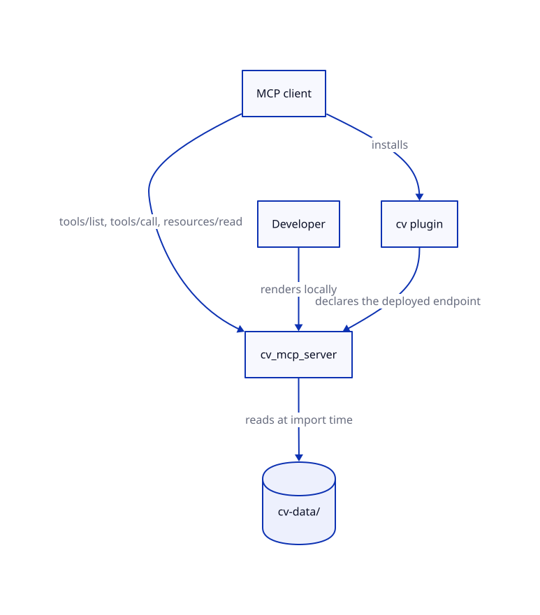
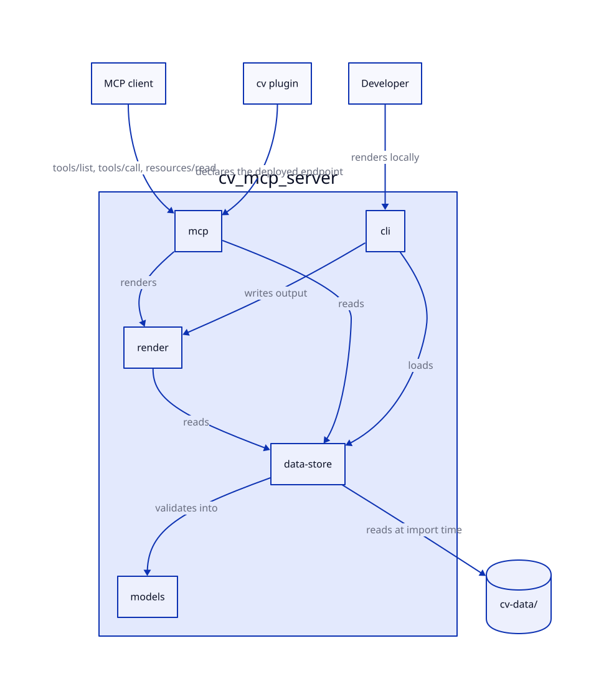

# Architecture Guide

<!-- Developer navigation guide. Every component name and file path in this document has been
     verified against the codebase. Only components that exist on disk are included.
     For design rationale and architectural evolution, see .ai-state/DESIGN.md.
     Maintained by pipeline agents: created by systems-architect, updated by implementer,
     verified by doc-engineer at pipeline checkpoints. -->

> **M1 restructuring complete.** This guide describes the code **as it exists on disk today** in `cv-forge`. The split into a data-only `cv` repo and this machinery repo is complete in code; repository creation and cutover are pending. For design rationale and future-planned components, see [`.ai-state/DESIGN.md`](../.ai-state/DESIGN.md).

## 1. Overview

| Attribute | Value |
|-----------|-------|
| **System** | cv-forge |
| **Type** | MCP server + document renderer + CLI + two Claude Code plugins |
| **Language / Framework** | Python 3.13 / `mcp` 2.x (`MCPServer`), Jinja2, Pydantic v2 |
| **Architecture pattern** | Layered package: `models` and `render` know nothing about paths or the network; `data` owns both; `mcp` and `cli` are the two drivers |
| **Last verified against code** | 2026-09-14 |

The CV *data* lives in a separate `cv` repository. This codebase provides: an MCP server that serves CV content from GitHub Release assets (markdown, PDF, LaTeX, HTML, Typst, JSON) via 16 tools and 17 resources; a CLI for rendering, validation, and local development; two Claude Code plugins (consumer-facing and maintainer-facing); and publishing/deployment workflows.

## 2. System Context



<details>
<summary>Diagram source: <code>docs/diagrams/architecture/src/architecture.c4</code></summary>

Regenerate with the pre-commit `diagram-regen` hook, or manually:

```
likec4 gen d2 docs/diagrams/architecture/src -o docs/diagrams/architecture/rendered/
d2 docs/diagrams/architecture/rendered/context.d2    docs/diagrams/architecture/rendered/context.svg
d2 docs/diagrams/architecture/rendered/components.d2 docs/diagrams/architecture/rendered/components.svg
```

</details>

> **Component detail:** [Components](#3-components)

## 3. Components



<!-- aac:generated source=docs/diagrams/architecture/src/architecture.c4 view=components last-regen=2026-09-13 -->

### 3a. Structural components

| Component | Responsibility | Key Files |
|-----------|---------------|-----------|
| models | Pydantic definitions of the resume hierarchy (`Resume`, `WorkEntry`, `Project`, `Publication`, …), the semantic overlay (`SemanticOverlay`, `Topic`, `Relationship`, `SkillProficiency`) and the tailoring spec (`TailoringSpec`, `SectionDirective`, `EntryEmphasis`). Follow `ConfigDict(populate_by_name=True)` + `Field()`. | `src/cv_forge/models/resume.py`, `models/semantics.py`, `models/tailoring.py` |
| data-store | `ResumeStore`: read-only query layer over an already-parsed `Resume` and `SemanticOverlay` — entry index, cross-reference validation, and the query methods every tool reads through. A transitional `load(data_dir)` classmethod delegates to `data-boundary`'s `load_local_dir` for callers not yet wired through `CvDataProvider`; no file I/O happens in this class itself. <!-- aac-override: text-only description correction (topology unchanged), no .c4/diagram regen run — see LEARNINGS.md M1.4 --> | `src/cv_forge/data/store.py` |
| data-boundary | `CvDataSnapshot.parse()` (the one boundary constructor accepting raw bytes), the `LocalDir`/`ReleaseAssets`/`BakedSnapshot` origin sum type, `ReleaseManifest`/`AssetEntry`/`ArtifactUnavailable` (the `release.json` wire format, as Pydantic models), and `load_local_dir`. Also `CvDataProvider`: the one mutable holder of the current snapshot, its `Pinned`/`Fresh`/`Stale` refresh state, and the `ReleaseFetcher` `Protocol` a later step's httpx-based fetcher will satisfy. <!-- aac-override: new on-disk component, no .c4 model update / diagram regen run yet — see LEARNINGS.md M1.4, M1.6 --> | `src/cv_forge/data/{snapshot,release,local,provider}.py` |
| render | Jinja2 renderers for markdown, LaTeX (moderncv), HTML (self-contained, interactive) and Typst (moderner-cv), plus the tailored LaTeX and Typst variants, and the per-section markdown split. | `src/cv_forge/render/renderers.py`, `src/cv_forge/render/templates/` (13 `.j2` files) |
| mcp | The shared `MCPServer` instance (`mcp` 2.x), the ASGI app factory + lifespan (`app.py`, builds the app on a `CvDataProvider` and exposes `GET /healthz`), 17 `fps-cv://` resources, and 16 tools split across data, query, semantic and summarize modules. Tool and resource modules are auto-discovered by `pkgutil` walk at import time. | `src/cv_forge/mcp/server.py`, `app.py`, `resources.py`, `tools/{data,query,semantic,summarize}.py` |
| cli | The `cv-forge` console script: `render` (writes to `-o <dir>`, `-f pdf` compiles with `latexmk` in a scratch dir, `--release-tag` embeds a tag in HTML output only), `validate` (schema + cross-reference findings, exit 3 on any finding), `export-schemas` (`--check` exits 4 on drift), `fetch-snapshot` (downloads the three release-tracked files), `serve` (`--transport stdio\|http`, local MCP server). `--json` emits a machine-readable envelope with a `sha256` per output on every subcommand. <!-- aac-override: text-only description correction (topology unchanged), no .c4/diagram regen run — see LEARNINGS.md M1.32 --> | `src/cv_forge/cli/main.py` |

### 3b. Capabilities

| Capability | Responsibility | Key Files |
|-----------|---------------|-----------|
| Job-targeted tailoring | Reorder sections, filter or de-emphasise entries and override the profile summary for a specific job description, rendering to LaTeX or Typst for compilation. Driven by the `cv-tailoring` skill through `get_tailored_cv`. | `models/tailoring.py`, `render/renderers.py`, `mcp/tools/data.py`, `render/templates/cv_tailored.{tex,typ}.j2` |
| Semantic enrichment | Topic taxonomy, cross-entry relationships and skill proficiency layered over the structured resume, surfaced through the query tools and through enriched markdown, HTML and Typst renders. | `models/semantics.py`, `data/store.py`, `mcp/tools/semantic.py` |

<!-- aac:end -->

## 4. Interfaces

| Interface | Type | Provider | Consumer(s) | Contract |
|-----------|------|----------|-------------|----------|
| `fps-cv://*` | MCP resources | mcp | MCP clients | 17 URIs: rendered output (`pdf`, `md`, `md/sections{,/{name}}`, `latex`, `html`, `typst`), structured JSON (`resume`, `resume/entry/{id}`, `semantics`, `semantics/{entry_id}`, `taxonomy`), introspection (`schema/resume`, `schema/semantics`, `templates`, `templates/{format_id}`) and `links/{name}` |
| MCP tools | MCP tools | mcp | MCP clients | 16 tools: `get_cv`, `get_cv_sections`, `list_cv_sections`, `get_link`, `list_links`, `get_cv_pdf_link`, `get_google_scholar_link`, `get_tailored_cv`, `query_work`, `get_entry`, `list_entry_ids`, `query_by_topic`, `get_relationships`, `get_skill_profile`, `get_entry_context`, `summarize_cv` |
| `ResumeStore` | Python API | data-store | render, mcp, cli | `ResumeStore(resume, semantics)` plus read-only query methods; a transitional `ResumeStore.load(data_dir)` classmethod delegates to `data-boundary`'s `load_local_dir` — no semantics-persistence path remains |
| `render_*` | Python API | render | mcp, cli | `render_markdown`, `render_latex`, `render_html`, `render_typst`, `render_tailored_latex`, `render_tailored_typst`, `render_sections`, `get_section`, `section_names` — all take a store and return a string |
| `CV_DATA_DIR` | Environment variable | data-boundary | deployment, tests | When set, pins `CvDataProvider` to a local directory (`refresh_state: pinned`, no release fetch); unset means fetch-from-release with a baked-snapshot fallback |
| Plugin MCP declaration | JSON | cv plugin | Claude Code | `plugins/cv/.claude-plugin/plugin.json` declares `fps_cv_mcp` as a native HTTP endpoint; `plugins/cv/.claude-plugin/mcp-local.json` is the stdio dev override injected by `make install-claude-code` |

## 5. Data Flow

Data flows are diagrammed in [`.ai-state/DESIGN.md` §5](../.ai-state/DESIGN.md#5-data-flow) (release-sourced, refreshed in the background), which is now also the flow as built.

To trace it, start at `src/cv_forge/data/bootstrap.py::build_provider_from_env`: it resolves `CV_DATA_DIR` (pins to a local directory, no fetch) or falls through to a `GitHubReleaseFetcher` against `CV_RELEASE_REPO` with a baked-snapshot fallback (`CV_BAKED_DIR`), producing one `CvDataProvider`. Both drivers construct it the same way — the Edge entrypoint's ASGI factory (`mcp/app.py::create_app`) binds it to `app.state` and starts the refresh loop in its lifespan; `cli/main.py::_cmd_serve` binds it for the local `stdio`/`http` server. `src/cv_forge/mcp/server.py`'s own `_register_modules()` walks `cv_forge.mcp.tools` with `pkgutil` and imports `resources` at import time, which is what activates the `@mcp.tool` and `@mcp.resource` decorators — adding a new tool module requires no edit to any driver.

## 6. Dependencies

External dependencies, versions, and criticality classifications are listed in [`.ai-state/DESIGN.md` §6](../.ai-state/DESIGN.md#6-dependencies). The declared runtime set in `pyproject.toml` is `mcp>=2.2,<3`, `loguru>=0.7.3,<0.8`, `pyyaml>=6.0,<7.0`, `jinja2>=3.1,<4` and `pydantic>=2.12,<2.13.5` (WASIX `pydantic-core` ceiling — see `scripts/check_wasix_ceilings.py`); `httpx2` (the release fetcher's HTTP client) arrives transitively through `mcp`.

## 7. Constraints

System constraints (performance, compatibility, technical, security) are listed in [`.ai-state/DESIGN.md` §7](../.ai-state/DESIGN.md#7-constraints). The ones that bind day-to-day development here:

- Run tests with `pixi run -e dev python -m pytest` — the `-e dev` flag matters, because a `pyenv` shim can intercept a bare `pytest`.
- `` blocks in the LaTeX and Typst templates protect native syntax from Jinja2 and process independently inside ``. LaTeX commands containing `{#N}` must be inside a raw block, because `{#` opens a Jinja2 comment.
- `_template_context()` passes `enrich=False` for every LaTeX render; semantic enrichment applies to markdown, HTML and Typst only.

## 8. Decisions

<!-- aac:authored owner=systems-architect last-reviewed=2026-09-13 -->

Architectural decisions are recorded as ADRs in [`.ai-state/decisions/`](../.ai-state/decisions/). The canonical, auto-generated cross-reference is `DECISIONS_INDEX.md`, regenerated at finalize; in-flight fragments live under [`decisions/drafts/`](../.ai-state/decisions/drafts/). For design-target rationale, see [`.ai-state/DESIGN.md`](../.ai-state/DESIGN.md) — this developer guide intentionally does not summarize decisions inline.

<!-- aac:end -->
